# AES-CBC mode is unsafe


Cipher Block Chaining (CBC) was designed to eliminate the block-repetition leaks of ECB by XORing each plaintext block with the preceding ciphertext block. However, CBC mode provides **confidentiality without integrity**. That lack of authentication makes ciphertext malleable: flipping bits in one block alters the next block deterministically, unauthenticated decryption leaks padding validation side channels (padding oracles), predictable IVs break IND-CPA security, and oracle access enables arbitrary message forgery without knowing the key.

**[▶ Open the interactive site →](https://llody9977.github.io/cbc-mode/)** — every attack below runs live in your browser against real AES.

## Run the attacks yourself, in the browser

The site turns each weakness into an interactive demonstration you can drive. The cryptography is **real AES** executed via the standard Web Crypto API locally in your browser — zero server calls.

- **Bit-flipping malleability** — modify ciphertext bytes to inject chosen changes into decrypted plaintext (e.g. forging an admin role) without triggering decryption errors.
- **Padding oracle decryption** — recover complete plaintext byte-by-byte in at most 256 queries per byte via a 1-bit padding validation leak (the Vaudenay 2002 / POODLE mechanism).
- **Predictable IV attack** — exploit chained or predictable IVs in TLS 1.0 connections to recover secret session cookies via chosen plaintext (the BEAST attack / CVE-2011-3389).
- **Ciphertext forgery (CBC-R)** — synthesize valid ciphertext for arbitrary chosen plaintext using only a decryption padding oracle — zero key access and zero encryption calls.
- **The fix** — the same token under AES-GCM: flip one bit and watch the authentication tag immediately reject the tampered ciphertext before any plaintext is released.



## Structure

- [`docs/`](docs/) — the GitHub Pages site and technical write-up: [`index.html`](docs/index.html), [`styles.css`](docs/styles.css), and theme-aware SVG [`diagrams/`](docs/diagrams/).
- [`docs/js/`](docs/js/) — the demo logic: [`crypto.mjs`](docs/js/crypto.mjs) (AES-CBC/GCM, PKCS#7) and [`attacks.mjs`](docs/js/attacks.mjs) (the four vectors), plus [`ui.mjs`](docs/js/ui.mjs) which wires them to the page.
- [`test/`](test/) — a Node test suite that exercises the modules against real AES, including official NIST SP 800-38A Section F.2.1 AES-128-CBC test vectors.
- [`reviews/`](reviews/) — the review audit trail and durable content decisions register.

## Develop

```bash
npm ci            # install eslint (tests need no dependencies)
npm test          # node --test — verifies every vector against real AES
npm run lint      # eslint

# preview the interactive site locally
python3 -m http.server -d docs 8000   # then open http://localhost:8000
```

Diagrams are regenerated with:
```bash
python3 docs/diagrams/generate_diagrams.py
```

## Security

Found a vulnerability? Report it privately — see [`SECURITY.md`](SECURITY.md). Do not open a public issue for security reports.

## Disclaimer

For **educational and defensive** security research. Every demonstration runs entirely in your browser against self-contained in-memory mock oracles — no network and no third-party system. Use these techniques only against systems you own or are explicitly authorized to test. See [`DISCLAIMER.md`](DISCLAIMER.md).

## License

Licensed under **Apache-2.0** — see [`LICENSE`](LICENSE). Covers the whole repository: code, documentation, and diagrams.
