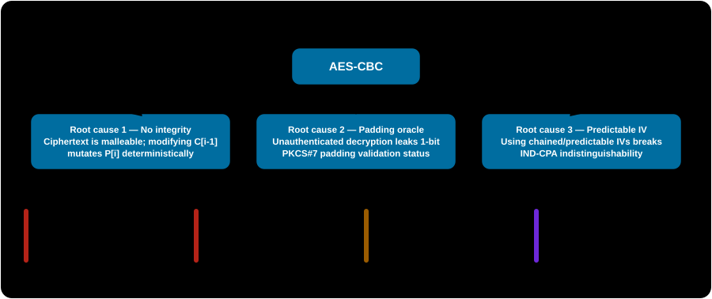

# Unauthenticated AES-CBC is unsafe


CBC encrypts data, but it does not prove that the ciphertext is authentic. Without authentication, an attacker can alter plaintext, exploit padding feedback, or forge messages without learning the key. CBC remains sound when every IV is unpredictable and Encrypt-then-MAC is implemented correctly. Modern systems usually choose AEAD because it supplies confidentiality and integrity as one construction.

**[▶ Open the interactive site →](https://llody9977.github.io/cbc-mode/)** — every attack below runs live in your browser against real AES.

## Run the attacks yourself, in the browser

The site turns each weakness into an interactive demonstration you can drive. The cryptography is **real AES** executed via the standard Web Crypto API locally in your browser — zero server calls.

- **Bit-flipping malleability** — modify ciphertext bytes to inject chosen changes into decrypted plaintext (e.g. forging an admin role) without triggering decryption errors.
- **Padding oracle decryption** — recover complete plaintext byte-by-byte through a PKCS#7 validation leak, averaging roughly 128 oracle queries per byte and requiring up to 256 plus disambiguation checks (Vaudenay 2002).
- **Predictable IV attack** — exploit chained or predictable IVs in TLS 1.0 connections to recover secret session cookies via chosen plaintext (the BEAST attack / CVE-2011-3389).
- **Ciphertext forgery (CBC-R)** — synthesize valid ciphertext for arbitrary chosen plaintext using only a decryption padding oracle — the attacker has neither the key nor an encryption oracle. Requires the endpoint to accept an attacker-supplied IV; otherwise the first block decrypts to garbage (Rizzo & Duong, WOOT 2010).
- **The fix** — the same token under AES-GCM: flip one bit and watch the authentication tag immediately reject the tampered ciphertext before any plaintext is released.



## Structure

- [`docs/`](docs/) — the GitHub Pages site and technical write-up: [`index.html`](docs/index.html), [`styles.css`](docs/styles.css), and SVG [`diagrams/`](docs/diagrams/). Its light-only visual system matches the sibling Secret Exposure articles.
- [`docs/js/`](docs/js/) — the demo logic: [`crypto.mjs`](docs/js/crypto.mjs) (AES-CBC/GCM, PKCS#7) and [`attacks.mjs`](docs/js/attacks.mjs) (the four vectors), plus [`ui.mjs`](docs/js/ui.mjs) which wires them to the page.
- [`test/`](test/) — a Node test suite that exercises the modules against real AES. The AES-CBC primitive is checked against the official NIST SP 800-38A §F.2.1 vectors; each attack vector is separately exercised end-to-end, including the progress-callback path the browser UI uses and secrets longer than one block.

## Develop

```bash
npm ci            # install the pinned development dependencies
npx playwright install chromium  # one-time browser runtime for the UI regression test
npm test          # node --test — verifies every vector and the browser UI against real AES
npm run lint      # eslint
npm run validate:html

# preview the interactive site locally
python3 -m http.server -d docs 8000   # then open http://localhost:8000
```

Diagrams are regenerated with:
```bash
python3 docs/diagrams/generate_diagrams.py
```

## Security

Found a vulnerability? Report it privately — see [`SECURITY.md`](SECURITY.md). Do not open a public issue for security reports.

## Disclaimer

For **educational and defensive** security research. Every demonstration runs entirely in your browser against self-contained in-memory mock oracles — no network and no third-party system. Use these techniques only against systems you own or are explicitly authorized to test. See [`DISCLAIMER.md`](DISCLAIMER.md).

## License

Licensed under **Apache-2.0** — see [`LICENSE`](LICENSE). Covers the whole repository: code, documentation, and diagrams.
